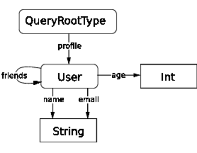
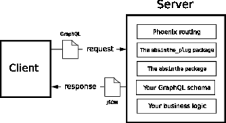

# Chapter 1: Meet GraphQL

GraphQL is a query language that gives the users of an API the ability to describe the data that they want, and lets creators of the API focus on data relationships and business rules, instead of worrying about the various data payloads the API needs to return. (p. 3)

## On the Client

The application sends a GraphQL document to the server, and the server responds with a JSON document, having consulted a schema that describes data it has available to query and to modify. (p. 3)

REST is focused on the actions you can take with _resources_, and its simplicity falls away pretty suddenly as the needs of clients become more varied and the surface area of the API expands. (p. 5) The spec has nothing to say about relationships or RPC operations that are needed, especially from an internal perspective.

GraphQL is a standardized (based on a specification), expressive query language focused on flexibly meeting API client needs. (p. 5)

Getting a user `123`'s name and email (p. 5)
```graphql
{
  user(id: 123) {
    name
    email
  }
}
```

Results in a JSON response (p. 5)
```json
{
  "data": {
    "user": {
      "name": "Joe Bob",
      "email": "joe.bob@foo.com"
    }
  }
}
```

### Including Relationships

Originating at Facebook, GraphQL's focus is helping clients query across relationships - across the graph of related entities, hence the name. (p. 6)

When using a REST API, here are some questions we should probably ask ourselves: (p. 6)
* Can we get a user’s friends via /users/:id, or do we need to use a different resource URL?
* Are friends (or their names) included by default, or do we need to specify that we want them?
* How do we do that?
* When information about friends is returned, where will it be in the result?
* Is each friend’s data embedded, or just referenced, forcing us to do more requests to retrieve it?
* Will we need to paginate the friends list?
* How will this affect our performance on mobile devices, where bandwidth may be limited and additional requests have a negative effect on performance and battery life?

This is a lot of unnecessary mental overhead, requiring researching documentation (if it exists and is complete) and doing exploratory testing just to determine how to access the data we need from the API. (p. 6)

### GraphQL Simplifies Things

If you know users have friends, you can query across that relationship getting exactly the information that you want in a single request. (p. 6)

We simply ask for what we want in our query (p. 7)
```graphql
{
  user(id:123) {
    name
    email
    friends {
      name
    }
  }
}
```

The result is the same as before but with the requested friends' information included (p. 7)
```json
{
  "data": {
    "user": {
      "name": "Joe Bob",
      "email": "joe.bob@example.com",
      "friends": [
        { "name": "Fred Jones" },
        { "name": "Jane Smith" },
        { "name": "Rebekah Jones" }
      ]
    }
  }
}
```

Looking at the client side code, you know exactly what you can expect to be there because you have a GraphQL query at hand which tells you the shape of the response you’ll get back from the server. (p. 7)

From a backend perspective, because queries are coming in as a declarative query language detailing what clients need, you gain an incredibly detailed picture of what information your clients actually need. (p. 7)

SQL is a query language that allow you to retrieve exactly what you want, especially if you do not have to specify the joins, akin to using assocs in Ecto. (p. 7)

## On the Server

GraphQL query documents can be flexible because the server holds a complete schema describing the shape of data that the API models and the input that it can expect from clients. This means that you, as the API developer are responsible for accurately building a representation of your data. (p. 8)

### User Input Validation in REST

REST, as a standard, doesn’t really have much to say about data validation, and so enforcing rules about incoming data is left up to the code that handles the request. (p. 8)

An index action in an events controller's only job is to return a list of filtered events. (p. 8)

Our controller is trying to do three distinct tasks: Validate the input from the user Get the data the user wants Respond to the user in the correct format. (p. 9)

we’re doing too much work here that’s outside our core goal: getting the events. (p. 9)

### GraphQL Inputs

With GraphQL we have a predefined schema with declared types and rules about the input that we can receive from users to retrieve data. When someone sends you data, it is checked by these rules before our code is executed. (p. 9)

This keeps our _resolution_ code focused on its primary objective: doing what the user wants. (p. 9)

Requests that fail to pass validation never get the chance to execute your business logic (equivalent to failing varse validation). (p. 10)

Once we have a schema in place, the input data given to our code is guaranteed to have met the rules we’ve declared about it. (p. 10)

### Queries and Schemas



This is a graph showing User (a custom type in our schema), and String and Int (built-in types) as nodes, with the fields name, email, age, and friends as edges, representing the relationships between the types. (p. 11)

Because the User type has fields and represents a complex value, GraphQL refers to it as an object type, whereas Int and String are simple values that it refers to as scalar types and have no fields of their own. (p. 11)

Object types can have fields that point to themselves, which is what we see with the User type’s friends edge. This means that all objects in our graph that are of the User type can have friends, and that each of those friends will also be of type User. (p. 12)

When we query a GraphQL schema, we’re really just walking these edges and getting the data associated with them. (p. 12)

All queries start at a root object we have on our schema graph (we’re calling it RootQueryType). (p. 12)

## Absinthe and the Tech Stack

The application being built, PlateSlate, models the menu, ordering, and order fulfillment needs of a quick service restaurant chain. (p. 13)



After a web request reaches the _absinthe_plug_, Absinthe takes over: validating the request, parsing against our schema, and calling our resolution business logic.
